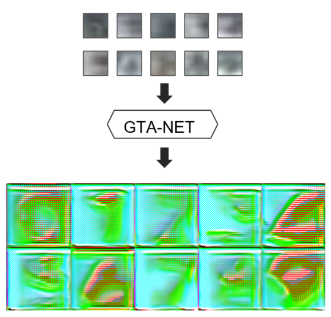
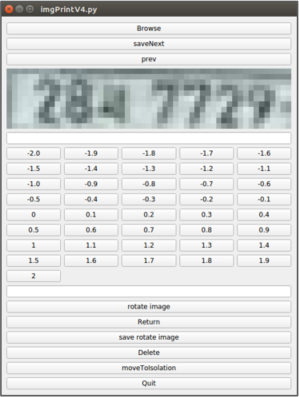
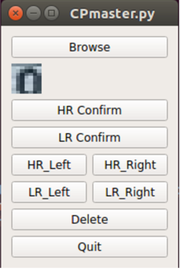
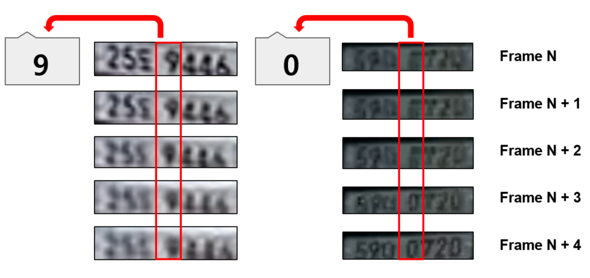
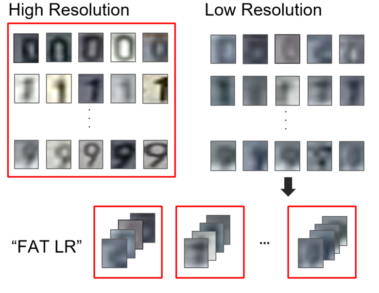
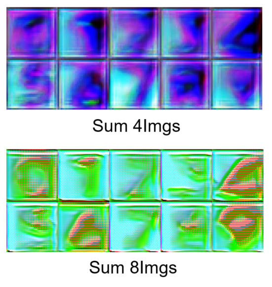

# GreatTracerAuto Network

## 소개
- 적대적 네트워크(GAN) 사용 경험을 위한 프로젝트.
- 식별이 어려운 번호판을 인식하여 숫자를 판독할 수 있게 해주는 프로젝트.
- 번호판 인식 2-1을 하며 해상도가 낮아 인식이 어려운 경우가 많음을 확인하여 Srgan의 해상도 복원 Gan을 기초로 GtaNetwork를 구성.
- Project that enables the identification of difficult-to-identify license plates and the ability to read numbers

## 결과물

## 프로젝트 과정
### 번호판 인식
1. Yolo (사용 못함)
가장 쉽게 사용하고 사물인식 예습으로 해서 가장 사용하기 편했던 Network.  
하지만 정확도측면에서 아쉬움이 있었고 Yolo보다 다른 Network 가 정확도 가 높았기에 Yolo는 사용 안함.  
  
2. Faster-RCNN  
2-1. 1차 인식  
 - 블랙박스 이미지(여러 차량 및 주변환경이 보임)에서 번호판을 인식.
 - 결과물이 그다지 좋지 않았고 그에 대한 문제점으로 번호판의 크기가 작다보니 정확한 dataset이 불완전하다고 판단.
 - 인식한 이미지에 10pixel정도 더 크게 하여 이미지를 저장하여 해당 이미지로 다시 번호판을 정밀하게 mark를 침.  
2-2. 2차 정밀 인식  
 - 번호판만 있는 이미지에서 좀 더 정확한 부분으로 dataset을 만들어 학습.  
 - 좀 더 정확하게 번호판이 인식됨을 확인.  
   
최종. Faster-RCNN을 2번 돌려 얻은 이미지를 결과물로 가져가기로 함.  
 - FasterRCNN 폴더 DK_final_object_detector_mod_xyplusjsd.py 파일
 - 블랙박스 이미지에서 2-1 학습weight로 번호판 인식, 인식한 이미지를 가지고 2-2 학습weight로 재인식.

*** FasterRCNN 학습은 구글의 tensorflow models(https://github.com/tensorflow/models)를 사용.  
아래 두 사이트를 참조하여 실행  
http://solarisailab.com/archives/2422 (protobuff 부분)  
https://ukayzm.github.io/pet-training/  
  
Data marking에는 https://github.com/mwindowshz/YoloToTfRecords   
사이트를 참조하여 Yolo-Mark파일을 Faster-RCNN학습에 맞게 변환시켜 사용하였음.  

### GTA-Net Dataset 구성을 위한 이미지 정제
1. 번호판 이미지만 직사각형으로 추출 (실패)
 - 블랙박스 특성상 이미지 왜곡이 꽤 일어나있기에 직사각형으로 돌려주는 기능을 만들려고 시도함.
 - Opencv Canny를 사용 번호판의 테두리를 인식, 나머지 이미지를 잘라내고 직사각형으로 Shear 도전.
 - 번호판 이미지들이 너무 열화되었기에 테두리 인식이 불안정함. canny외에도 2-3가지를 사용해보았으나 실패.
2. 수동 작업 Tool 개발
 - 왜곡되어 비뚫어진, 돌아간 번호판을 제대로 되게 회전해주는 Tool.  
 
 ** Ro-CP.py  
   
   
 - 3을 완료한 후 좀 더 정밀한 data를 위해 여백 및 불필요한 이미지 부분을 자르는 Tool.  
 
 ** Cu-CP.py  
   
   
3. 번호의 시리즈화를 위한 Object Tracking
 - Srgan 기본 구조상 Low-resolution 이미지와 복원할 High-resoulution 이미지가 필요함.
 - Low가 무슨 숫자인지 구분하기 위해 이미지 분석시 Object tracking이 필요했음.
 - 하여 xy좌표와 Jensen Shannon Divergence를 사용하여 같은 번호판은 한 폴더에 저장되게 DK_final_object_detector_mod_xyplusjsd.py 에 코드 추가.
   
   
 - 번호판에서 marking을 하며 자르고, 번호별로 폴더에 모아주는 Tool.(Yolo-Mark를 이용해 구현.)
   
   
4. 속도 개선을 위한 encoding
 - Onehotencoding 개념을 이용 이미지를 10x10 배열로 이어 붙이고 라벨을 부여해 주었음.(dataset_to_numpy_and_onehotencoding.py)
 
### GTA-Net
1. gta_utils.py
 - batch_generator: 부족한 그래픽카드를 보완하기 위한 제네레이터 생성 Function.
 - t_v_split: validation 비율 만들어 주는 Function.
 - make fat-lr: GTA-Net의 핵심 Function.
 * lr 한장만으로는 너무 작은 정보를 포함하고 있다고 판단(작은 파일은 3*5 픽셀의 크기) 정보량을 늘리고자 lr이미지를 4장 이어붙인 이미지와 Hr이미지 한장의 해상도를 복원해보도록 설계.  
 (W. Shi et al., Real-time single image and video super-resolution using and efficient sub-pixel convolutional neural network. CVPR, 2016. 논문 참조하여 크게 문제없을거라 판단.)  
    
    
 - save_val_imgs: output 이미지를 저장하는 Function.
2. SRgan Custom
 2-1. Srgan에서 Feature Extract 계산에 사용되는 Perceptual Loss에 대한 Custom (실패)
 기존 VGG19 사용했으나 더 좋은 Network들이 나왔음에 착안 Resnet이나 Nasnet을 사용하여 Perceptual Loss를 계산해봄
 일단 두 Network 다 그래픽카드의 성능이 떨어져 구현에 실패함.
  → Resnet의 경우 Loss값은 잘 계산함을 확인.
  → Nasnet의 경우 Network의 특성상(다량의 Skip Connection과 Add) 어느 부분에서 Loss값을 추출해야할지에 대한 난제. 시간 부족으로 try실패.

 - Srgan의 Generator 모델을 SR Resolution중 Sota기술인 RDN 사용. (실패)
  → 시간 부족으로 인한 어디서 잘못됐는지 검증 못함.
 
 - Subpixel 사용
  → 시간 부족으로 인한 논문에 대한 낮은 이해도와 그로 인한 코드 구현 실패.
  
  
 ### 아쉬운 점 및 개선할 점
 1. Edge검출의 한계로 자동화가 불명확해진 점.
 2. Edge검출 외에 동영상만 넣고 자동 검출하는 프로그램 및 작동 커리큘럼 개발.
 3. 시간적 여유로 못했거나 실패한 Network Custom들에 대한 여러가지 try와 test, 고찰
  3-1. RDN이 제대로 작동하고 있는지
  3-2. Custom Perceptual Loss 사용
   ** VGG19가 성능 대비 높은 Loss값을 주는것으로 잠정적 결론.
  3-3. Generator와 Discriminator의 Network Custom
  3-4. Fat-Lr의 다양화
  → fat-lr같은경우 기존 4장을 붙이는 것에서 8장을 붙이니 좀 더 좋아진 결과를 확인.
       
     
  3-5. Output Img를 사용하여 일반 Network 학습에 사용, 복원된 숫자를 인식하여 최종적으로 번호판의 번호 출력.
 
 
 
### 참고한 논문
I. Goodfellow et al., Generative adversarial nets. NIPS, pages 2672-2680, 2014.  
A. Radford et al., Unsupervised representation learning with deep convolutional generative adversarial networks. ICLR, 2016.  
J. Johnson et al., Perceptual losses for real-time style transfer and super-resolution. ECCV, pages 694-711. Springer, 2016.  
C. Ledig et al., Photo-realistic single image super-resolution using a generative adversarial network. CVPR, 2017.  
W. Shi et al., Real-time single image and video super-resolution using and efficient sub-pixel convolutional neural network. CVPR, 2016.  
Y. Zhang et al., Residual dense network for image super-resolution. CVPR, 2018.  
G. Huang et al., Densely connected convolutional networks. CVPR, 2017.  
K. Simonyan et al., Very deep convolutional networks for large-scale image recognition. ICLR, 2015.  
K. He et al., Deep residual learning for image recognition. CVPR, 2016.  
B. Zoph et al., Learning transferable architectures for scalable image recognition. CVPR, 2018.  

